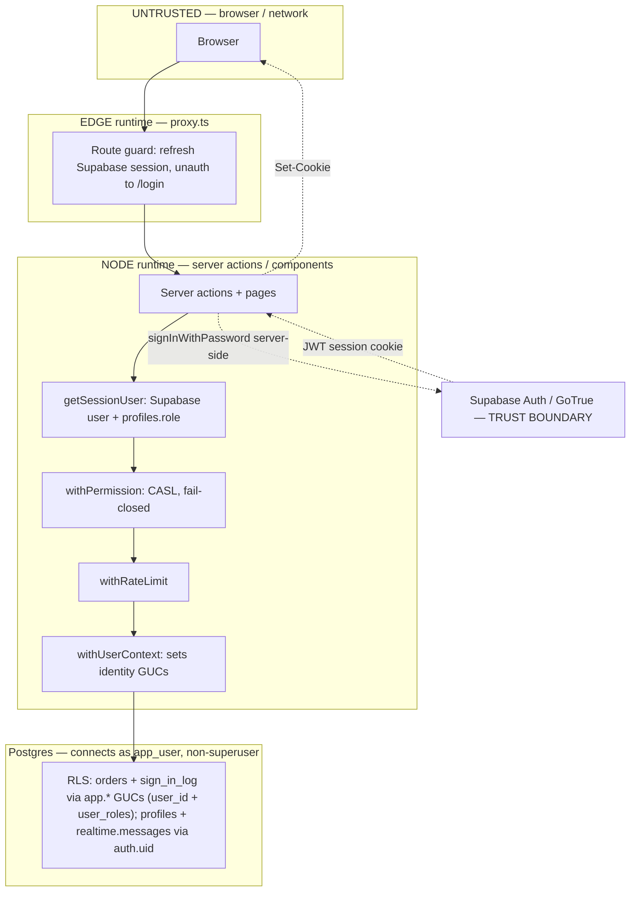
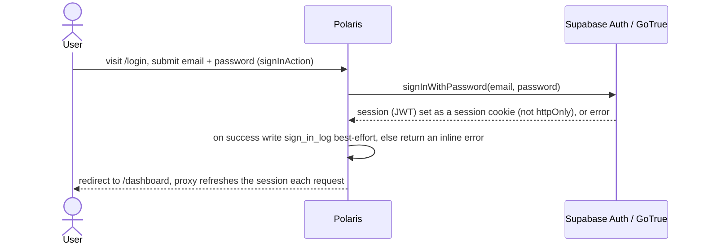
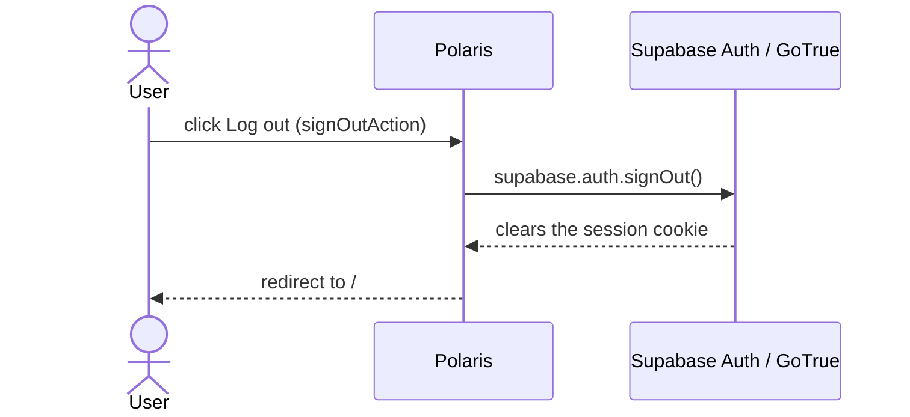
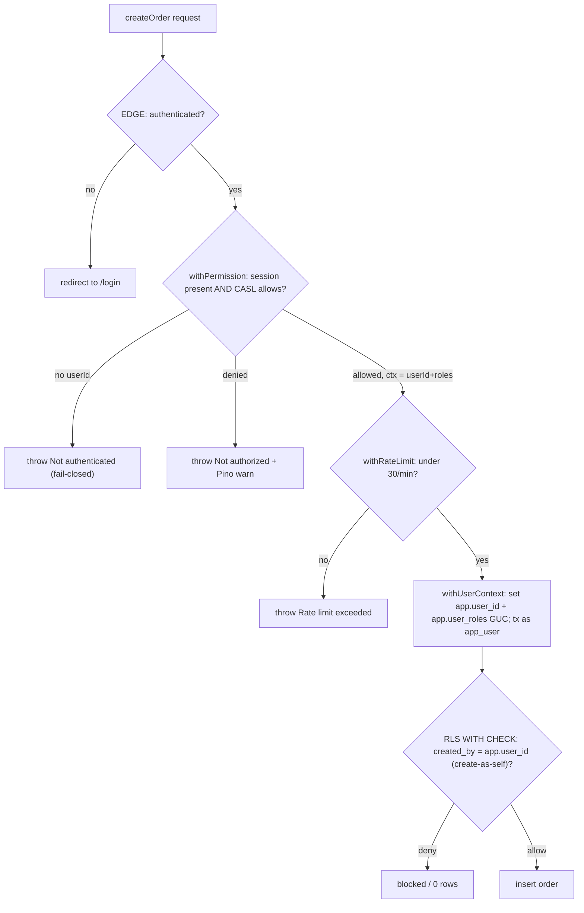
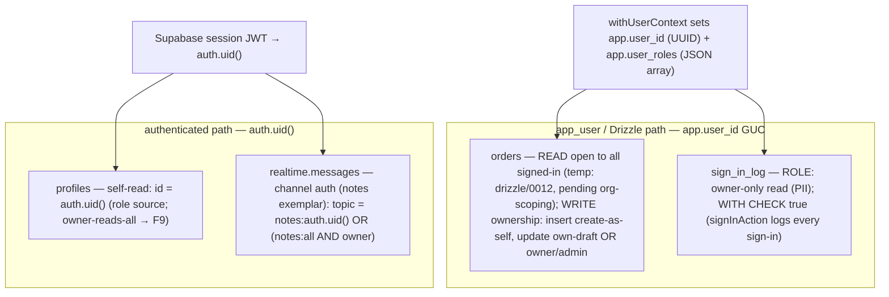
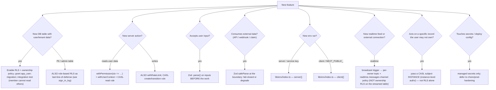

# Polaris Security Handbook

**Status:** living document — the **diagrams and per-mechanism detail** behind the security model.
The 14-layer overview and the control → file map live in [`HANDBOOK.md`](HANDBOOK.md) §3; the boundaries / Iron Rules in [`DOMAIN-CHARTER.md`](DOMAIN-CHARTER.md); the decisions in [`docs/adr/`](docs/adr/). This document holds the pictures. One fact, one home — where they overlap, the handbook's terse statement is authoritative.

---

## Threat model & trust boundaries

**Defend against:** unauthenticated access · cross-user row access · privilege escalation (role-string injection via the GUC) · crashes from malformed input/claims/env · framework fingerprint · write flooding · known-vulnerable deps.
**Trust (don't re-implement):** Supabase Auth/GoTrue (identity, credentials, password policy, rate-limited login) · `@supabase/ssr` JWT verification (a forged session cookie fails before our code) · host/network/TLS (deploy).

## Authentication (Supabase Auth)

Login is app-hosted (`/login` → `signInAction` → `signInWithPassword`); the session is a Supabase JWT in cookies — **not `httpOnly`** (the `@supabase/ssr` default, left in place deliberately), because the browser client must read the JWT for Realtime channel auth (XSS exfiltration is answered by CSP enforce+nonce at the transport layer, not by pretending the cookie is httpOnly — see `HANDBOOK.md` §3). The cookie is refreshed in `proxy.ts` and verified by `@supabase/ssr`. `userId` = `auth.users.id`; the app **role** comes from the `profiles` table (not a JWT claim). **No registration in the app** — accounts are provisioned out-of-band today (Supabase Studio/CLI: an `auth.users` user **and** a matching `profiles` row), via invite-code at F9, public sign-up at F14 (ADR-0003). Logout is a single `supabase.auth.signOut()` (no second SSO step — that was a Keycloak artifact).

## Authorization & data access — the defense-in-depth stack

## RLS model — two identity paths

The app/Drizzle path connects as **`app_user`** and identifies via the **`app.user_id` GUC** (set by `withUserContext`). The Supabase-client path (auth/role reads) and **Supabase Realtime** identify via **`auth.uid()`** as the **`authenticated`** role. Tables carry policies for the path that reads them.

Roles in `app.user_roles` are **JSON-encoded** (`@> '["owner"]'`), never comma-joined — a role name can't collide with a delimiter (escalation fix).

**Live feed — the `notes` exemplar (orders not yet wired):** a `notes` trigger broadcasts each change to its owner's private topic (`notes:<created_by>` + `notes:all`); the `realtime.messages` policy gates each subscriber to their own topic — per-user realtime without the streamed table needing ownership RLS (the `drizzle/0021` scar, ADR-0002). An orders live feed would follow this exact pattern (templates in `lib/realtime/templates/`), but **no orders broadcast trigger exists today**.

**Orders read is currently open** (`drizzle/0012` `orders_read_all USING (true)`, with the CASL twin `can('read','Order')` unconditional): every signed-in `app_user` reads every order — a deliberate temporary simplification until org-scoping lands (see `docs/superpowers/specs/2026-06-26-orders-org-scoping-design.md`). Ownership today gates only **writes** (`orders_insert_self`, `orders_update_writer`).

## Input validation (Zod) — boundary table

| Boundary | Validates | Mode | Location |
|---|---|---|---|
| Identity context | `userId` UUID, `roles` string[] | `.parse` | `lib/db/with-user-context.ts` |
| Login input | `email`, `password` | `safeParse` | `app/_features/auth/actions.ts` |
| Server + client env | `DATABASE_URL`, `NEXT_PUBLIC_SUPABASE_*` (service-role key NOT in t3-env) | t3-env | `lib/env/index.ts` |

## Headers, rate limiting, supply chain, logging

- **Headers** (`lib/security-headers.ts`, attached via `next.config.ts`): `X-Frame-Options: DENY`, `nosniff`, `Referrer-Policy`, HSTS, `Permissions-Policy`, no `X-Powered-By`; **CSP report-only** (enforce+nonce → deploy).
- **Rate limiting**: rate-limiter-flexible `RateLimiterMemory` behind `withRateLimit(limiter, key, fn)`; `createOrder` 30/min/user; → Redis at scale.
- **Supply chain**: `npm audit --audit-level=high` CI gate + Dependabot.
- **Logging**: Pino (ops/denials); `sign_in_log` (successful logins). See [ADR-0006](docs/adr/0006-event-tracking-vs-operational-logging.md) for ops-logs vs the event table.

## Env validation (t3-env)

Env validation uses **t3-env** (`lib/env/index.ts`): `server` vars (`DATABASE_URL`, `LOG_LEVEL`) + `client` vars (`NEXT_PUBLIC_SUPABASE_URL`, `NEXT_PUBLIC_SUPABASE_ANON_KEY`). **`SUPABASE_SERVICE_ROLE_KEY` is deliberately NOT in t3-env** — no in-app code uses it (registration was removed), and t3-env's `server` schema would require it at boot for a key the app never reads; its readers (E2E global-setup, `scripts/seed-dev.ts`, `scripts/create-user.ts`) take it from `process.env` directly. Re-add at F9 when in-app provisioning consumes it.

---

## Adding a new feature — security checklist

Run every feature through this. **It is the 14-layer model expressed as questions.**

**Always:** TDD (failing test first); for anything touching RLS, an integration test under `app_user` (harness in `lib/db/__tests__/`). This checklist is why new work **stops being whack-a-mole** — each feature plugs into known layers up front.
