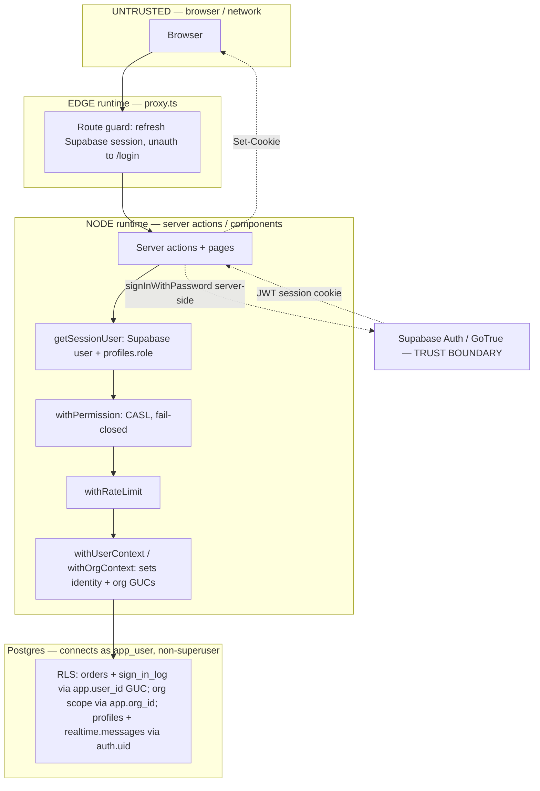
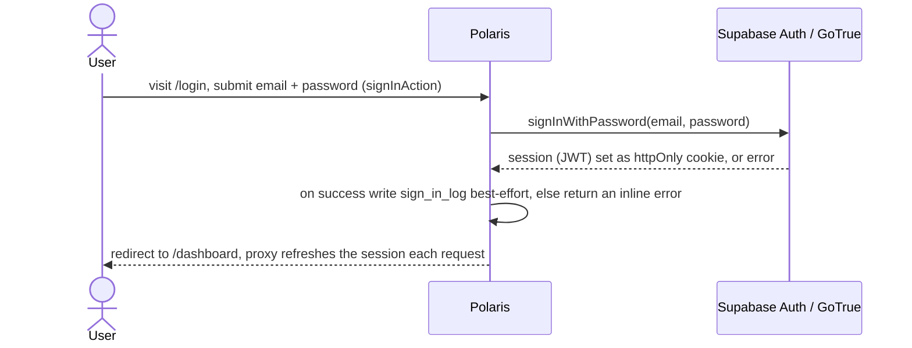
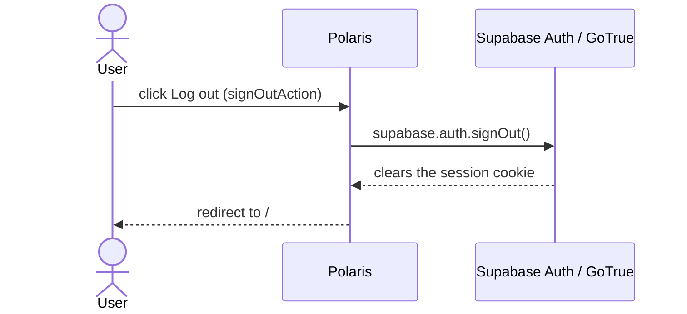
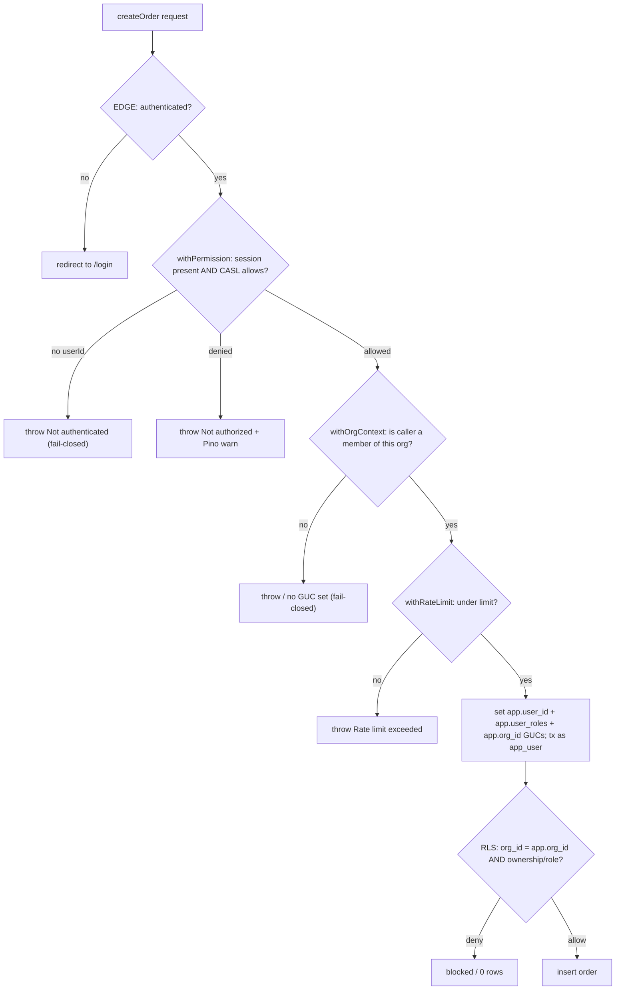
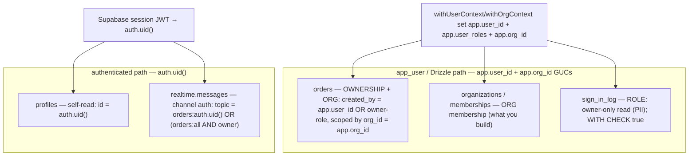
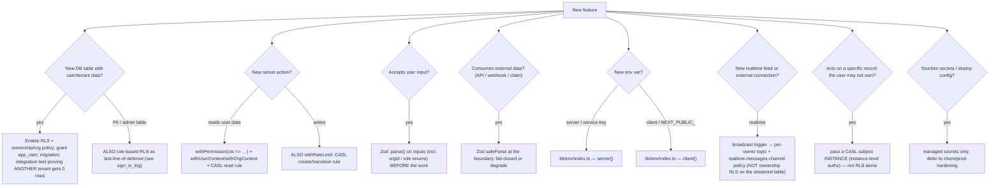

# Polaris — Security Handbook (the layers you build on)

This is the **security companion** to `IAM-FOUNDATION-PROJECT.md`. The IAM brief tells you
*what to build*; this tells you *what "secure" already means here* — the full 14-layer
model, where each layer stands, the mechanics (with diagrams), the threat model, the
new-feature checklist, and the control→file map. Read it once, keep it open, and check your
work against the **§7 checklist** on every PR.

> **Relationship to the IAM brief.** `IAM-FOUNDATION-PROJECT.md` §1–§6 is the condensed
> foundation; this document is the long form of the same model with the diagrams and the
> control→file map. Where the two overlap, they agree by design. **You extend the
> *app/Drizzle path* with a new `app.org_id` GUC — you do not invent new security.**

## Contents
1. The story · 2. Principles & conventions · 3. The secure-foundation model (14 layers) ·
4. Where the foundation stands · 5. Security mechanics (diagrams) · 6. The two role axes ·
7. New-feature checklist · 8. Control → file map · 9. Decisions (settled)

---

## 1. The story (security-relevant)
Polaris is an internal **cold-chain logistics order tool on Supabase** — Supabase Auth,
Postgres, and Supabase Realtime for a collaborative live order kanban. A clean rewrite
hardened the foundation feature-by-feature (CASL, RLS, non-superuser `app_user`, Zod
boundaries, t3-env, rate limiting, security headers). Identity is **Supabase Auth**
(`@supabase/ssr`); realtime is **Supabase Realtime** (Broadcast-from-Database). There is
**no public self-registration** — accounts are provisioned out-of-band. A Keycloak (OIDC) +
Centrifugo detour was reverted (2026-06-09): its justifying features (multi-app SSO,
federation, UMA authz, IdP multi-tenancy) were never needed — the most Polaris will have is
*users and organizations*, which is **application multi-tenancy in our own Postgres + RLS**
(what the IAM project builds), not the IdP.

---

## 2. Principles & conventions (the spine)
A foundation is "secure" because **every layer is addressed** and these hold **across all
of them**. Every decision traces to one of these — you don't invent security, you plug in.

| # | Principle | Concrete convention(s) in Polaris |
|---|-----------|-----------------------------------|
| 1 | **Fail closed** — deny by default | `withPermission` throws without a session; an invalid identity never reaches the DB. Your `withOrgContext` throws for a non-member. |
| 2 | **Defense in depth** — ≥2 layers, no single point of trust | CASL **and** RLS; route-guard **and** data-layer guards. **RLS = ownership/tenancy by default; role-based RLS only as a deliberate "last line of defense" on PII tables** (e.g. `sign_in_log`). **Streamed data is scoped at the channel layer** — per-owner broadcast topics + a `realtime.messages` policy (`auth.uid()`) — because Supabase Realtime can't honor the app's `app.user_id` GUC; tables keep ownership RLS for the app/Drizzle path. |
| 3 | **Validate at every trust boundary** | Zod at input/claims/env/events/headers: `.parse` (fail-closed) for identity/env, `safeParse` (degrade) where resilience matters. |
| 4 | **Least privilege** | App connects as non-superuser **`app_user`** (no `BYPASSRLS`, not table owner); migrations use a separate privileged role. **Never change this.** |
| 5 | **Tests mirror prod** | Non-superuser everywhere; RLS test harness under `app_user`; fresh-clone CI. A superuser test would bypass RLS and hide bugs. |
| 6 | **Test-first (TDD)** | Failing test before code; watch it fail → minimal code → watch it pass → commit. No production code without a red test that demanded it. |
| 7 | **Build-vs-buy discipline** | Libraries for hard problems (Zod, CASL, Drizzle, `@supabase/ssr`, t3-env, rate-limiter-flexible); hand-rolled only for thin app glue (guards/wrappers). |
| 8 | **Security rides with features** | Gate the surface as it lands — don't pre-harden things that don't exist yet, and never ship a surface ungated. |

**Other locked-in rules:** CASL = "can this role do this action", RLS = "which rows" ·
system roles **`owner`/`member`** (richer → F11b) and org roles **`org_admin`/`org_member`**
(what the IAM project adds) · env via **t3-env** (edge-safe `runtimeEnv`) · **Pino** for
ops/denials, `sign_in_log` for successful logins, `supa_audit` later for data-change audit ·
**Supabase Realtime (Broadcast-from-Database)** for the live feed (not polling, not
Centrifugo) · Postgres/Drizzle/`timestamptz` · `auth.uid()` RLS on Supabase-read tables
(`profiles`, `realtime.messages`); `app.user_id` GUC RLS on the app/Drizzle path (`orders`,
`sign_in_log`) · **roles are JSON-encoded** into role GUCs (`@> '["owner"]'`), never
comma-joined (a role name can't collide with a delimiter) · no secrets in code (`.env*`
gitignored) · one feature per branch, merge no-squash.

---

## 3. The secure-foundation model — 14 layers
A coherent full-stack foundation addresses all of these. **There are no empty rows.**
The layers the IAM project touches are in **bold**.

| # | Layer (what *good* looks like) | Polaris realization | Status |
|---|---|---|---|
| 1 | **Authentication** — delegate to a managed auth service | Supabase Auth (GoTrue) via `@supabase/ssr`; app-hosted login (no public registration — provisioning → F9); `getSessionUser` resolver | ✅ |
| 2 | **Session integrity** — signed, validated | Supabase JWT in httpOnly cookies, verified by `@supabase/ssr`; refreshed in `proxy.ts`; role from `profiles` | ✅ |
| 3 | **Authorization (coarse) — CASL** — roles/actions, fail-closed, logged | CASL `withPermission` (requires session, throws, Pino denial log). **You add `defineOrgAbilityFor`.** | ✅ |
| 4 | **Data isolation (fine) — RLS** — which rows, at the DB | RLS, two paths: app/Drizzle via `app.user_id` GUC (`orders` ownership, `sign_in_log` role); Supabase/`auth.uid()` (`profiles` self-read, `realtime.messages` channel auth). **You add `app.org_id` org-scoping.** | ✅ |
| 5 | **Least-privilege data access — `app_user`** | Non-superuser `app_user`; migrations privileged. **Never grant `BYPASSRLS`.** | ✅ |
| 6 | **Input / trust-boundary validation — Zod** | Zod at identity context, login input, env (server + client). **You `.parse` orgId / role enums.** | ✅ |
| 7 | **Configuration & secrets** | **t3-env** (validated, edge-safe, server/client guard); managed secrets → deploy | ✅ / 🔒 deploy |
| 8 | **Transport & browser hardening** | Security headers + report-only CSP; CSP-enforce+nonce + TLS → deploy | ✅ / 🔒 deploy |
| 9 | **Abuse resistance** | **rate-limiter-flexible** on writes; Supabase Auth rate-limited login; Redis → scale | ✅ / 🔒 deploy |
| 10 | **Observability & audit** | Pino (ops/denials); `sign_in_log`; `supa_audit` → F10 | ✅ / 🔒 F10 |
| 11 | **Supply chain** | Dependabot + `npm audit` CI gate | ✅ |
| 12 | **Resilience / recovery** | Stale-chunk auto-reload; chunk retention → deploy | ✅ / 🔒 deploy |
| 13 | **Verification — TDD + RLS harness** | TDD; unit + integration + E2E; fresh-clone CI; non-superuser RLS harness | ✅ |
| 14 | **Structure / maintainability** | Feature folders; `lib/` grouped (auth/ supabase/ env/ db/ permissions/); documented conventions | ✅ |

**Layers 1–5 were F1–F5** (the directed work). **Layers 6–14 were later work** — completed
one cell at a time. Same foundation, discovered out of sequence. You will mostly live in
**Authorization (3)**, **Data isolation (4)**, **Input validation (6)**, **Verification
(13)**, and **Structure (14)**.

---

## 4. Where the foundation stands
- **Complete & coherent:** every data path is two-layered; every boundary validated; the app
  runs least-privilege; nothing ships untested. Layers 1–6, 11, 13, 14 fully; 7–10, 12 at
  their **pre-deploy maximum** (report-only CSP, in-memory rate-limit, ops logging,
  recover-without-prevent).
- **Intentionally deferred (principled, not gaps):**
  - Instance-CASL, **org/customer-RLS**, audit → 🔒 gated on the *features they protect*
    (the IAM project / F6 / F10). Hardening absent surface violates principle 8. *(Realtime
    channel authz ✅ shipped with F7.)*
  - CSP-enforce, managed secrets, TLS, Redis rate-limit, chunk retention → 🔒 gated on a
    *deploy target* (inert/premature without HTTPS/scale).
- **Genuine open gaps:** ~none at the app layer. Residual = low-severity *transitive*
  dependency advisories (monitored) + the deploy bundle.

**What this means for you:** the org-scoping the IAM project adds (`app.org_id`,
`withOrgContext`, org-scoped RLS) is the deferred "fine data isolation for tenancy" — you
are filling a layer-4 cell that was always intended to land with the org feature.

---

## 5. Security mechanics

### Threat model & trust boundaries
**Defend against:** unauthenticated access · cross-user / **cross-org** row access ·
privilege escalation (role-string injection via the GUC) · crashes from malformed
input/claims/env · framework fingerprint · write flooding · known-vulnerable deps.
**Trust (don't re-implement):** Supabase Auth/GoTrue (identity, credentials, password
policy, rate-limited login) · `@supabase/ssr` JWT verification (a forged session cookie
fails before our code) · host/network/TLS (deploy).



### Env validation (t3-env)
Env validation uses **t3-env** (`lib/env/index.ts`): `server` vars (`DATABASE_URL`,
`LOG_LEVEL`) + `client` vars (`NEXT_PUBLIC_SUPABASE_URL`, `NEXT_PUBLIC_SUPABASE_ANON_KEY`).
**`SUPABASE_SERVICE_ROLE_KEY` is deliberately NOT in t3-env** — no in-app code uses it
(registration was removed), and t3-env's `server` schema would *require it at boot* for a
key the app never reads; the only reader (E2E user seeding) takes it from `process.env`
directly. Re-add at F9 when in-app provisioning consumes it. Env unit tests use
`// @vitest-environment node`; `SKIP_ENV_VALIDATION` covers builds; the integration config
injects test client values (no `.env` loading there).

### Authentication (Supabase Auth)
Login is **app-hosted** (`/login` → `signInAction` → `signInWithPassword`); the session is a
Supabase JWT in httpOnly cookies, refreshed in `proxy.ts` and verified by `@supabase/ssr`.
`userId` = `auth.users.id`; the app **role** comes from the `profiles` table (not a JWT
claim). **No registration in the app at all** — no `/register`, no `registerAction`. Accounts
are created out-of-band (Supabase Studio/CLI: an `auth.users` user **and** a matching
`profiles` row with a role). Logout is a single `supabase.auth.signOut()`.





### Authorization & data access — the defense-in-depth stack
Both layers must pass. The IAM proof (`IAM 11`) shows the DB layer stands **alone**: even if
app code forces `app.org_id` to an org the user isn't in, RLS still returns zero rows,
because the policy doesn't depend on app code being correct.



### RLS model — two identity paths
Polaris reaches Postgres two ways, and **each table is protected for the path that reads
it**. The app/Drizzle path connects as **`app_user`** and identifies via the **`app.user_id`
GUC** (set by `withUserContext`); org scope comes from the **`app.org_id` GUC** (set by your
`withOrgContext`). The Supabase-client path (auth/role reads) and Supabase Realtime identify
via **`auth.uid()`** as the **`authenticated`** role. **A policy written for one path is
blind to the other** — put the policy on the path that actually queries the table.

| Path | Connects as | Identity comes from | Tables |
|---|---|---|---|
| **App / Drizzle** | non-superuser **`app_user`** | GUCs `app.user_id` + `app.user_roles` (+ **`app.org_id`**), set per-transaction | `orders`, `sign_in_log`, **`organizations`**, **`memberships`** |
| **Supabase client** | `authenticated` | **`auth.uid()`** from the session JWT | `profiles`, `realtime.messages` |


**Concrete, from the live schema (`lib/db/schema.ts`):**
```ts
// APP PATH — app_user, app.user_id GUC:
orders_owner_or_self  TO app_user
  USING (created_by = current_setting('app.user_id', true)::uuid OR <owner-role>)
  WITH CHECK (created_by = current_setting('app.user_id', true)::uuid)

sign_in_log_owner_read TO app_user
  USING (<app.user_roles contains 'owner'>)  -- role-based, PII table

// SUPABASE PATH — authenticated, auth.uid():
profiles_select_self  TO authenticated  USING (id = auth.uid())
orders_read_own_topic TO authenticated  USING (realtime.topic() = 'orders:'||auth.uid() OR <owner firehose>)
```
Roles in `app.user_roles` are **JSON-encoded** (`@> '["owner"]'`), never comma-joined — a
role name can't collide with a delimiter (escalation fix). **Live order feed:** an `orders`
trigger broadcasts each change to its owner's private topic (`orders:<created_by>` +
`orders:all`); the `realtime.messages` policy gates each subscriber to their own topic —
per-user realtime without the streamed table needing ownership RLS (the `drizzle/0021` scar).
**Everything the IAM project builds (`organizations`, `memberships`, `orders.org_id`) lives
on the APP PATH** and is scoped by the new `app.org_id` GUC.

### Input validation (Zod) — boundary table
| Boundary | Validates | Mode | Location |
|---|---|---|---|
| Identity context | `userId` UUID, `roles` string[] | `.parse` | `lib/db/with-user-context.ts` |
| **Org context** | `orgId` UUID, org `role` enum | `.parse` | `lib/db/with-org-context.ts` *(you build)* |
| Login input | `email`, `password` | `safeParse` | `app/_features/auth/actions.ts` |
| Server + client env | `DATABASE_URL`, `NEXT_PUBLIC_SUPABASE_*` (service-role key NOT in t3-env) | t3-env | `lib/env/index.ts` |

### Headers, rate limiting, supply chain, logging
- **Headers** (`next.config.ts`): `X-Frame-Options: DENY`, `nosniff`, `Referrer-Policy`,
  HSTS, `Permissions-Policy`, no `X-Powered-By`; **CSP report-only** (enforce+nonce → deploy).
- **Rate limiting**: rate-limiter-flexible `RateLimiterMemory` behind
  `withRateLimit(limiter, key, fn)`; `createOrder` 30/min/user; → Redis at scale.
- **Supply chain**: `npm audit --audit-level=high` CI gate + Dependabot.
- **Logging**: Pino (ops/denials); `sign_in_log` (successful logins).

---

## 6. The two role axes (IAM-specific)
- **System role** — `profiles.role` (`owner`/`member`), platform-wide, **already exists**.
- **Org role** — `memberships.role` (`org_admin`/`org_member`), authority *inside one org*,
  **what you build**. A user can be `org_admin` of A and `org_member` of B at once.

CASL answers "can this *org role* do this action" (`defineOrgAbilityFor`); RLS answers
"which rows belong to *this org*" (`org_id = current_setting('app.org_id')::uuid`).

---

## 7. Adding a new feature — security checklist (THE gate — every PR answers this)
Run every feature through this. **It is the 14-layer model expressed as questions.**



Equivalent quick-reference (the same gate, in text):
```
New DB table with tenant data?  → Enable RLS + scope policy + grant app_user + migration
                                  + an integration test proving ANOTHER tenant gets 0 rows.
New server action?              → withPermission(ctx => …) + (org context) + a CASL rule.
   …that writes?               → ALSO withRateLimit + a CASL create/transition rule.
Accepts user input?            → Zod .parse() BEFORE the work.
Acts on a record the user      → pass a CASL subject INSTANCE (instance-level authz),
   may not own?                  not RLS alone.
```

**Always:** TDD (failing test first); for anything touching RLS, an integration test under
`app_user` (harness in `lib/db/__tests__/`). This checklist is why new work **stops being
whack-a-mole** — each feature plugs into known layers up front. **If a table or action is
tenant-scoped and there is no test where another tenant gets zero rows / a thrown denial —
it is not done.**

---

## 8. Control → file map (where each layer lives — copy these, don't reinvent)
| Control | File(s) |
|--------|---------|
| Edge session refresh + route guard | `proxy.ts`, `lib/permissions/routes.ts` |
| Supabase clients (cookie-bound / browser) | `lib/supabase/server.ts`, `lib/supabase/browser.ts` |
| Sign-in / sign-out actions (+ `sign_in_log` write) — **no registration** | `app/_features/auth/actions.ts` |
| App-hosted login UI | `app/login/page.tsx`, `app/_features/auth/LoginForm.tsx` |
| Identity resolver (user + `profiles.role`) | `lib/auth/session.ts` (`getSessionUser`) |
| App authorization (CASL) | `lib/permissions/guard.ts`, `lib/permissions/ability.ts` |
| Identity → DB context + RLS GUCs | `lib/db/with-user-context.ts` |
| **Org context + `app.org_id` GUC (you build)** | `lib/db/with-org-context.ts` |
| Schema + RLS policies (incl. `profiles`, `realtime.messages`) | `lib/db/schema.ts`, `drizzle/*.sql` |
| Realtime broadcast trigger | `drizzle/0009_orders_broadcast_trigger.sql` |
| Live orders island | `app/_features/orders/{useOrdersRealtime.ts,OrdersLive.tsx}` |
| Non-superuser connection (never touch) | `lib/db/client.ts` |
| Env validation (t3-env; server + client) | `lib/env/index.ts` |
| Rate limiting | `lib/rate-limit.ts` |
| Security headers / CSP | `next.config.ts` |
| Stale-chunk recovery | `app/_features/shell/ChunkErrorReloader.tsx` |
| RLS integration tests (every table) | `lib/db/__tests__/*-rls.integration.test.ts` |
| Dependency monitoring | `.github/dependabot.yml`, `.github/workflows/ci.yml` |
| Logging | `lib/logger.ts` |

---

## 9. Decisions (settled — the security-relevant ones)
1. **Roles:** `owner`/`member` (system) only for now (richer → F11b); the IAM project adds
   the org axis `org_admin`/`org_member`.
2. **`sign_in_log` role-based RLS — KEEP** as defense-in-depth on a PII table (2026-06-08);
   convention amended to permit role-based RLS as a 2nd layer on sensitive tables
   (principle 2 / §2).
3. **Keycloak reversed → Supabase Auth + Realtime (2026-06-09).** Its justifying features
   were never needed and it broke Supabase Realtime; the most Polaris will have is users +
   orgs (app multi-tenancy in our DB). Centrifugo dropped.
4. **No public self-registration.** Internal tool; accounts are admin/invite provisioned
   (F9). Roles come from `profiles`, not a JWT claim.
5. **Realtime = Broadcast-from-Database.** Per-user scoping lives at the channel layer
   (per-owner topic + `realtime.messages` policy), because the streamed table's ownership
   RLS can't be honored by the Realtime authorizer (the `0021` scar).
6. **`profiles` self-read RLS only** (owner-reads-all removed — it self-references `profiles`
   → infinite recursion; revisit non-recursively at F9).

---

## Bottom line
Layers 1–6, 11, 13, 14 are fully built; 7–10, 12 sit at their pre-deploy maximum. The IAM
project's job is to **extend the app/Drizzle path with org scope (`app.org_id`)** — filling
the deferred layer-4 tenancy cell — without poking a hole in any layer. The **§7 checklist
is the filter**: every feature plugs into known layers up front, and a tenant-scoped surface
without an isolation test is not done.
