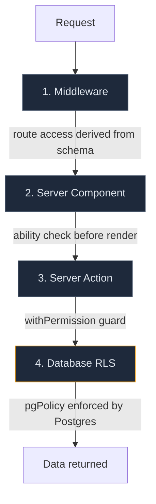
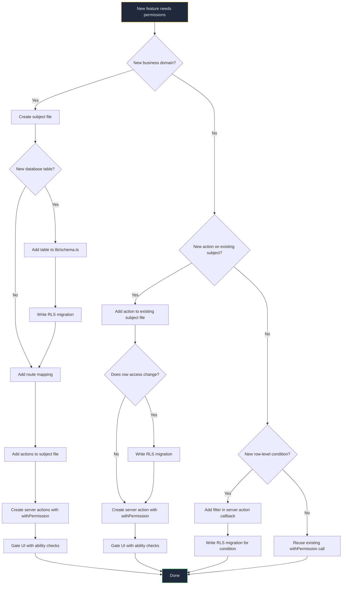
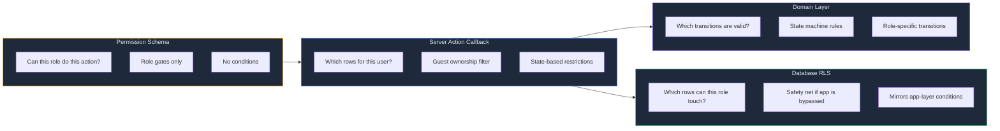

# Centralized Permissions Architecture

## Two Layers

The app layer and database layer answer different questions. Each owns its definitions. They share ownership conditions where they overlap.

| Layer | Question | Source of truth |
|-------|----------|-----------------|
| App (CASL) | Can this role perform this business action? | `lib/permissions/schema.ts` |
| Database (RLS) | Which rows can this role SELECT/INSERT/UPDATE/DELETE? | `pgPolicy()` in migration SQL |

Business actions (transition, export, duplicate) don't map 1:1 to SQL operations (SELECT, UPDATE). RLS is a coarser security floor. The app layer handles the fine-grained business logic on top.

### Why decoupled?

Multiple business actions map to the same SQL operation. Forcing them through one schema creates policies that are either too broad or a growing pile of edge cases.

| App action | SQL operation | Why they differ |
|-----------|---------------|-----------------|
| `transition` | UPDATE | One of many things that mutate an order |
| `duplicate` | INSERT | Business logic, not just "can you insert a row" |
| `export` | SELECT | Not every role that can read should export |
| `discard` | UPDATE (status change) | Not a DELETE at the database level |

Each layer does what it's good at. The app layer handles business action granularity. RLS handles row-access boundaries.

### Why not an external policy engine?

| Option | Why not now |
|--------|-------------|
| Oso / Cerbos | Adds sidecar, network hop, operational cost |
| OpenFGA (Zanzibar) | Over-engineered for role-based, single-tenant |
| Cerbos + `@cerbos/orm-drizzle` | Generates app-level WHERE, not Postgres RLS — doesn't protect against direct REST calls |

Revisit at multi-tenancy or cross-service authorization.

## Postgres roles vs app roles

These are different concepts that share the word "role."

**Postgres roles** are database-level identities. Supabase has a handful of built-in ones:

| Postgres role | What it is |
|--------------|------------|
| `anon` | Unauthenticated requests (no JWT) |
| `authenticated` | Any request with a valid JWT |
| `service_role` | Backend admin — bypasses all RLS |
| `postgres` | Superuser |

**App roles** (`system`, `owner`, `admin`, `member`, `guest`) are data — a value stored in the `profiles` table and embedded in the JWT as a custom claim via the access token hook. Postgres doesn't know about them natively.

In a RLS policy, these two concepts appear in different places:

```sql
CREATE POLICY orders_select_guest ON orders
  FOR SELECT TO authenticated           -- ← Postgres role (blocks anon)
  USING (
    (auth.jwt() ->> 'user_role')         -- ← app role (reads from JWT)
    = 'guest'
    AND created_by = auth.uid()          -- ← per-user (reads user ID from JWT)
  );
```

`TO authenticated` is the Postgres role gate. The `USING` clause reads the app role and user ID from the JWT for fine-grained checks. CASL only knows about app roles — it never touches Postgres roles.

## File Structure

```
lib/permissions/
  subjects/
    order.ts        Role gates for Order actions
    settings.ts     Role gates for Settings actions
  schema.ts         Merges subjects, exports types
  abilities.ts      Derives CASL MongoAbility from schema
  guard.ts          withPermission() wrapper for server actions
  hooks.tsx         AbilityProvider + useAbility() React hook
  routes.ts         Route-to-subject mapping, derives access from schema

lib/schema.ts       Drizzle schema — tables and columns
drizzle/*.sql       Migrations — RLS policies defined here
```

## Enforcement Depth



Each layer catches what the one above misses. A direct Supabase REST call skips 1–3 but is still stopped by 4.

---

## Adding a Feature: Complete Workflow

Every feature that touches permissions follows this decision tree. The schema is always the starting point — but it is not always the only file you touch.

### Decision Tree



### Files Touched Per Change Type

| Change | Subject file | Server action | UI | RLS migration | routes.ts | lib/schema.ts |
|--------|:-----------:|:------------:|:--:|:------------:|:---------:|:------------:|
| New business action, existing row access | ✓ | ✓ | ✓ | — | — | — |
| New business action, new row access | ✓ | ✓ | ✓ | ✓ | — | — |
| New subject with new table | ✓ | ✓ | ✓ | ✓ | ✓ | ✓ |
| New subject using existing table | ✓ | ✓ | ✓ | Maybe | ✓ | — |
| New row-level condition on existing action | — | ✓ | — | ✓ | — | — |
| New page for existing subject | — | — | Maybe | — | — | — |
| New server action reusing existing permission | — | ✓ | Maybe | — | — | — |

Most changes are the first row — a new business action where the existing RLS policies already cover which rows the role can access.

---

## How To Implement Each Layer

### 1. Permission Schema (role gates)

```typescript
// lib/permissions/subjects/thing.ts
import type { SubjectPermissions } from '../schema'

export const thingPermissions = {
  create: { roles: ['member', 'admin', 'owner'] },
  read:   { roles: ['guest', 'member', 'admin', 'owner'] },
  delete: { roles: ['admin', 'owner'] },
} as const satisfies SubjectPermissions
```

Then register in `lib/permissions/schema.ts`:

```typescript
import { thingPermissions } from './subjects/thing'

export const permissions = {
  Order: orderPermissions,
  Settings: settingsPermissions,
  Thing: thingPermissions,  // ← add this
} as const satisfies PermissionSchema
```

The schema answers one question: **does this role have this capability at all?** No conditions, no row filters, no state checks.

### 2. Server Action (business logic gate)

```typescript
// app/_features/things/data/actions.ts
'use server'

import { withPermission } from '@/lib/permissions/guard'

export async function createThingAction() {
  return withPermission('create', 'Thing', async ({ profile }) => {
    // business logic — permission already verified
  })
}

export async function readThingsAction() {
  return withPermission('read', 'Thing', async ({ profile }) => {
    // per-user filtering happens HERE, not in the schema
    if (profile.role === 'guest') {
      return await findThings({ createdBy: profile.id })
    }
    return await findThings()
  })
}
```

Per-user conditions (ownership, state) are gated inside the `withPermission` callback. The guard handles authentication and role-level access. The callback handles row-level logic.

### 3. UI (render gate)

```tsx
// In a server component:
const ability = defineAbilityFor(profile.role)
if (!ability.can('read', 'Thing')) notFound()

// In a client component:
const { ability } = useAbility()
{ability.can('create', 'Thing') && <CreateButton />}
{ability.can('delete', 'Thing') && <DeleteButton />}
```

### 4. RLS Policies (database floor)

```sql
-- drizzle/0027_things_rls.sql

-- Internal roles see all rows
CREATE POLICY things_select_internal ON things
  FOR SELECT TO authenticated
  USING ((auth.jwt() ->> 'user_role') IN ('owner', 'admin', 'member'));

-- Guests see only rows they created
CREATE POLICY things_select_guest ON things
  FOR SELECT TO authenticated
  USING (
    (auth.jwt() ->> 'user_role') = 'guest'
    AND created_by = auth.uid()
  );

-- Insert: must set created_by to self
CREATE POLICY things_insert ON things
  FOR INSERT TO authenticated
  WITH CHECK (
    (auth.jwt() ->> 'user_role') IN ('member', 'admin', 'owner')
    AND created_by = auth.uid()
  );

-- Delete: admin/owner only
CREATE POLICY things_delete ON things
  FOR DELETE TO authenticated
  USING ((auth.jwt() ->> 'user_role') IN ('admin', 'owner'));
```

RLS mirrors the schema's role gates but answers a different question: not "can you do this action" but "which rows can you touch." Even if the app layer has a bug, the database blocks unauthorized access.

### 5. Route Mapping

```typescript
// lib/permissions/routes.ts
const routeToSubject: Record<string, string> = {
  '/orders':   'Order',
  '/settings': 'Settings',
  '/things':   'Thing',   // ← add this
}
```

Route access is derived automatically: if a role has any action on the subject, they can access the route.

---

## The Three Patterns

Every policy is one of these:

| Pattern | App layer (withPermission) | RLS (pgPolicy) |
|---------|---------------------------|-----------------|
| **Role-only** | Schema gate is sufficient | `(auth.jwt() ->> 'user_role') IN ('admin', 'owner')` |
| **Per-user** | Filter in callback: `{ createdBy: profile.id }` | `created_by = auth.uid()` |
| **Combined** | Schema gate + callback filter for specific roles | Role check in `IN (...)` OR role + `auth.uid()` match |

In CASL, `profile.id` is the user identity. In RLS, the same concept is `auth.uid()`. In CASL, `profile.role` is the app role. In RLS, it's `auth.jwt() ->> 'user_role'`.

---

## Where Each Concern Lives



| Question | Where it's answered | NOT here |
|----------|-------------------|----------|
| Can this role create orders? | Permission schema | Server action |
| Can this guest see this specific order? | Server action callback + RLS | Permission schema |
| Can this role transition from drafted to submitted? | Domain layer (`getAllowedTransitions`) | Permission schema |
| Can a direct REST call read this row? | RLS | Anywhere else |
| Can this role access /orders? | Route mapping (derived from schema) | Manual route map |
| Should this button be visible? | UI ability check (`useAbility`) | Server action |

---

## Invariant

> The permission schema is the single source of truth for role-to-action gates. The app layer and database layer enforce the same ownership boundaries through their own mechanisms. Business action granularity lives in server action callbacks and domain logic. Row-access boundaries live in Postgres RLS. Neither drifts because each is defined in exactly one place.
